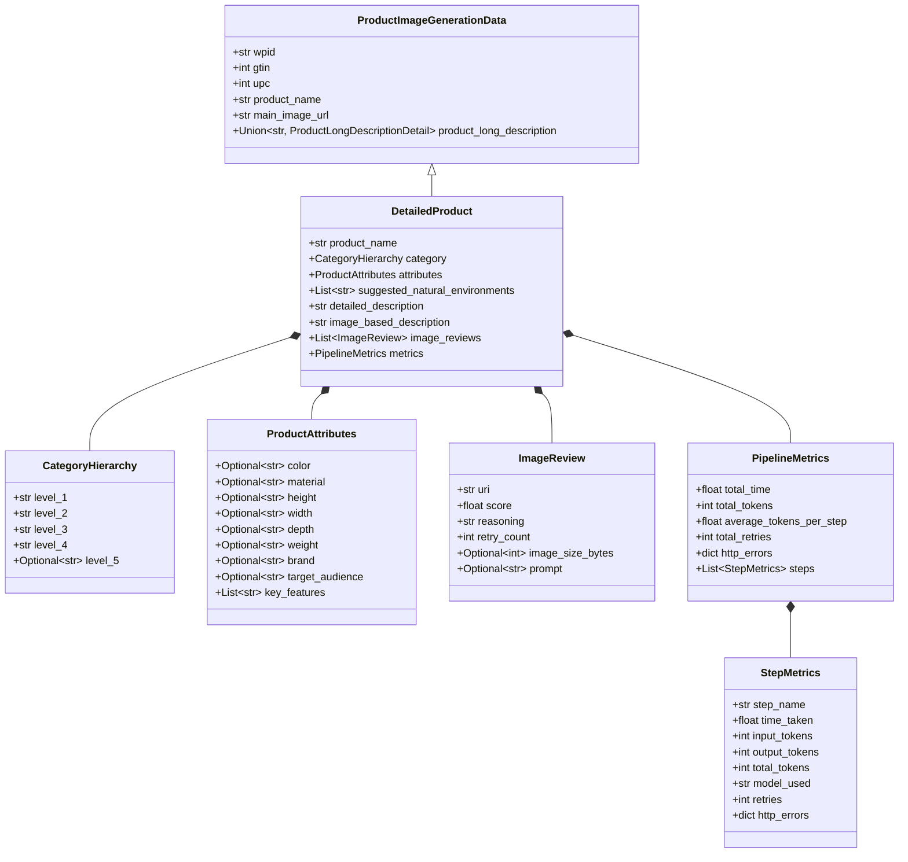

# Data Models & Schemas

The data architecture is defined in [`model.py`](../api/model.md) using **Pydantic v2**, establishing end-to-end type safety, validation, and JSON serialization.

---

## Schema Relationship Diagram



---

## Core Domain Models

### `ProductImageGenerationData`
The base model representing raw or normalized records ingested from Excel source files:

```python
class ProductImageGenerationData(BaseModel):
    wpid: Optional[str] = None
    gtin: Optional[int] = None
    upc: Optional[int] = None
    ean: Optional[int] = None
    reqmt_lvl_desc: Optional[str] = None
    product_type: Optional[str] = None
    ptg: Optional[float] = None
    product_name: Optional[str] = None
    product_long_description: Optional[Union[str, ProductLongDescriptionDetail]] = None
    product_short_description: Optional[str] = None
    main_image_url: Optional[str] = None
    attribute_key: Optional[str] = None
    value: Optional[str] = None
    model: Optional[str] = None
    data_source: Optional[str] = None
```

### `ProductEnrichment`
The schema passed to the primary enrichment model (`gemini-3.1-pro-preview`) to enforce structured JSON output:

```python
class ProductEnrichment(BaseModel):
    product_name: str = Field(description="The formal, descriptive name of the product")
    category: CategoryHierarchy = Field(description="Deep 4+ level category relationship for PDP")
    attributes: ProductAttributes = Field(description="Product attributes aligned with Schema.org where applicable")
    suggested_natural_environments: List[str] = Field(description="2 or 3 distinct, highly visual dynamic settings")
    detailed_description: str = Field(description="A deep, rich description of the product")
```

### `CategoryHierarchy`
Enforces a standardized 4+ level retail taxonomy:

| Field | Type | Description | Example |
| :--- | :--- | :--- | :--- |
| `level_1` | `str` | Top-level division | `Electronics` |
| `level_2` | `str` | Category group | `Computers & Accessories` |
| `level_3` | `str` | Product class | `Computer Monitors` |
| `level_4` | `str` | Granular sub-class | `Curved Gaming Monitors` |
| `level_5` | `Optional[str]` | Optional leaf attribute | `OLED Gaming Displays` |

### `ProductAttributes`
Standardized product specifications mapped to Schema.org vocabulary:

| Field | Schema.org Equivalent | Description |
| :--- | :--- | :--- |
| `color` | `color` | Primary product color |
| `material` | `material` | Primary construction materials |
| `height`, `width`, `depth` | `height`, `width`, `depth` | Physical dimensions |
| `weight` | `weight` | Net weight |
| `brand` | `brand` | Manufacturer or brand entity |
| `target_audience` | `audience` | Target demographic or use-case |
| `key_features` | N/A | Bulleted value propositions |

---

## Likeness & Quality Review Models

### `ProductLikenessReview`
The schema enforced on the multimodal Judge model:

```python
class ProductLikenessReview(BaseModel):
    score: float = Field(
        description="Likeness score between 0.0 and 1.0 representing how well the generated image matches the original product."
    )
    reasoning: str = Field(
        description="Detailed reasoning for the score, comparing the generated image with the original reference image(s)."
    )
```

### `ImageReview`
The runtime record stored in the product output directory:

```python
class ImageReview(BaseModel):
    uri: str = Field(description="URI or path to the generated image")
    score: float = Field(description="Likeness score between 0.0 and 1.0")
    reasoning: str = Field(description="Reasoning for the score")
    retry_count: int = Field(default=0, description="Number of retries for this image")
    image_size_bytes: Optional[int] = Field(default=None, description="Size of generated image in bytes")
    prompt: Optional[str] = Field(default=None, description="The specific prompt used for this attempt")
```

---

## Telemetry & Metrics Models

### `StepMetrics`
Profiles the execution of individual operations (e.g., search, enrich, describe, generate, judge, rewrite):

```python
class StepMetrics(BaseModel):
    step_name: str
    time_taken: float
    input_tokens: Optional[int] = None
    output_tokens: Optional[int] = None
    total_tokens: Optional[int] = None
    model_used: Optional[str] = None
    retries: int = 0
    http_errors: dict[int, int] = Field(default_factory=dict)
    images_passed: Optional[bool] = None
```

### `PipelineMetrics`
Rollup metrics accumulated per SKU:

```python
class PipelineMetrics(BaseModel):
    total_time: float = 0.0
    steps: List[StepMetrics] = Field(default_factory=list)
    total_tokens: int = 0
    average_tokens_per_step: float = 0.0
    total_retries: int = 0
    http_errors: dict[int, int] = Field(default_factory=dict)
    retries_to_pass: Optional[int] = None
```
