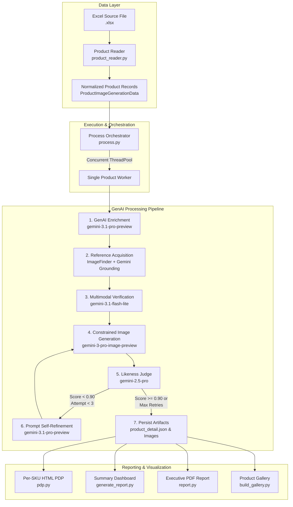

# Architecture Overview

The **Walmart Product Generation Pipeline** implements an autonomous, multi-stage processing pipeline built around Google Gemini generative foundation models and Pydantic schema validation.

---

## High-Level Block Diagram

---

## Architectural Principles

### 1. Strict Schema Adherence via Pydantic
All data passing through the system is strictly typed using Pydantic v2 models. GenAI requests use structured outputs with `response_schema` and `response_mime_type="application/json"` to eliminate schema drift and parsing anomalies.

### 2. Multi-Tier Model Fallback & Resiliency
Model interactions are encapsulated in a robust execution wrapper [`call_gemini`](../api/utils.md) that provides:
- **Primary to Fallback Switching**: If primary pro models (`gemini-3.1-pro-preview`) encounter quota exhaustion or upstream service errors, the pipeline automatically falls back to flash models (`gemini-3-flash-preview` / `gemini-2.5-flash`).
- **Exponential Backoff**: Transient network and HTTP errors trigger exponential backoff with jitter.
- **Sliding-Window Rate Limiting**: Global thread-safe rate limiter restricting outbound calls to 25 requests per minute to maintain API quota compliance.

### 3. Closed-Loop Visual Feedback Control
Rather than generating an image in an open-loop fashion, the pipeline introduces an automated quality control auditor:
- The **Judge** multimodal model acts as an objective quality inspector, comparing the generated image to downloaded ground-truth manufacturer images.
- If the likeness score falls below the configurable threshold (`PASS_THRESHOLD`, default `0.90`), the judge's reasoning is injected into an automated prompt rewriting model that diagnoses visual deficiencies and issues a corrected image generation prompt.

### 4. Comprehensive Telemetry & Observability
Every execution step records granular telemetry within [`StepMetrics`](data-models.md#stepmetrics) and [`PipelineMetrics`](data-models.md#pipelinemetrics):
- Execution time in seconds
- Input token counts
- Output token counts
- HTTP error tallies mapped by status code
- Applied model IDs
- Multimodal conditioning flags (Image + Prompt vs. Prompt Only)
