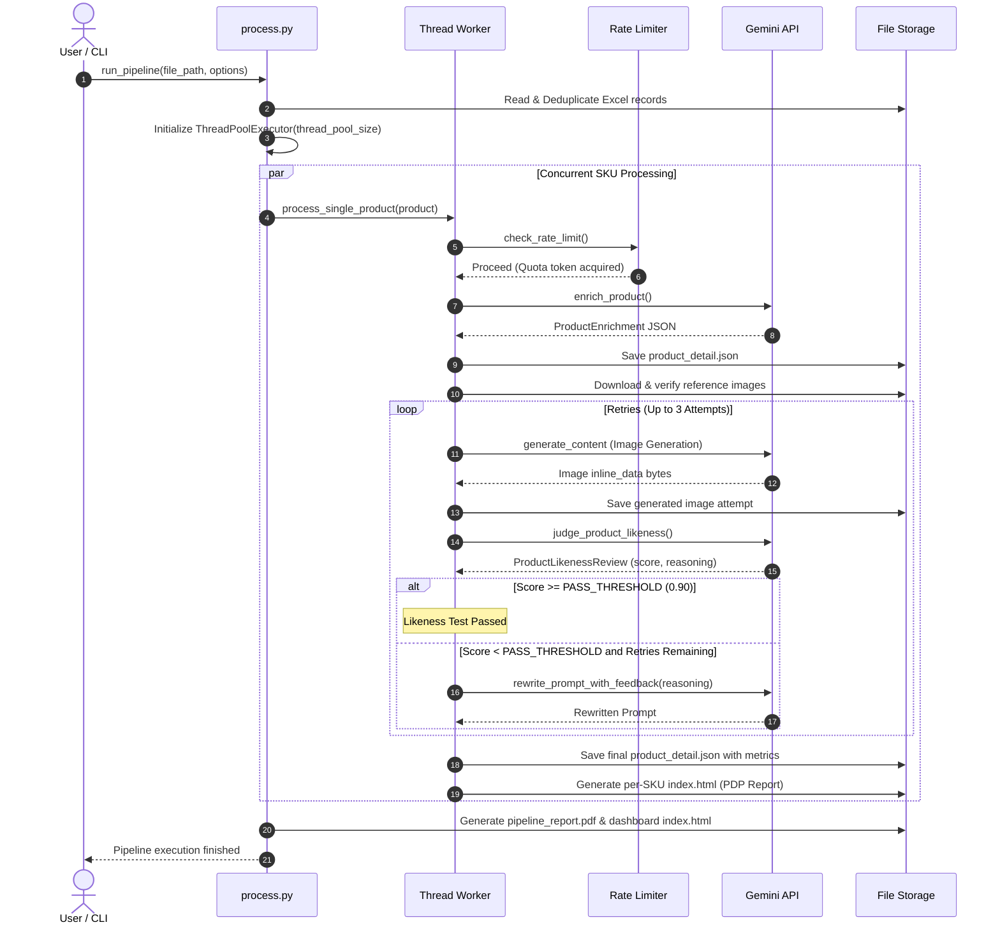
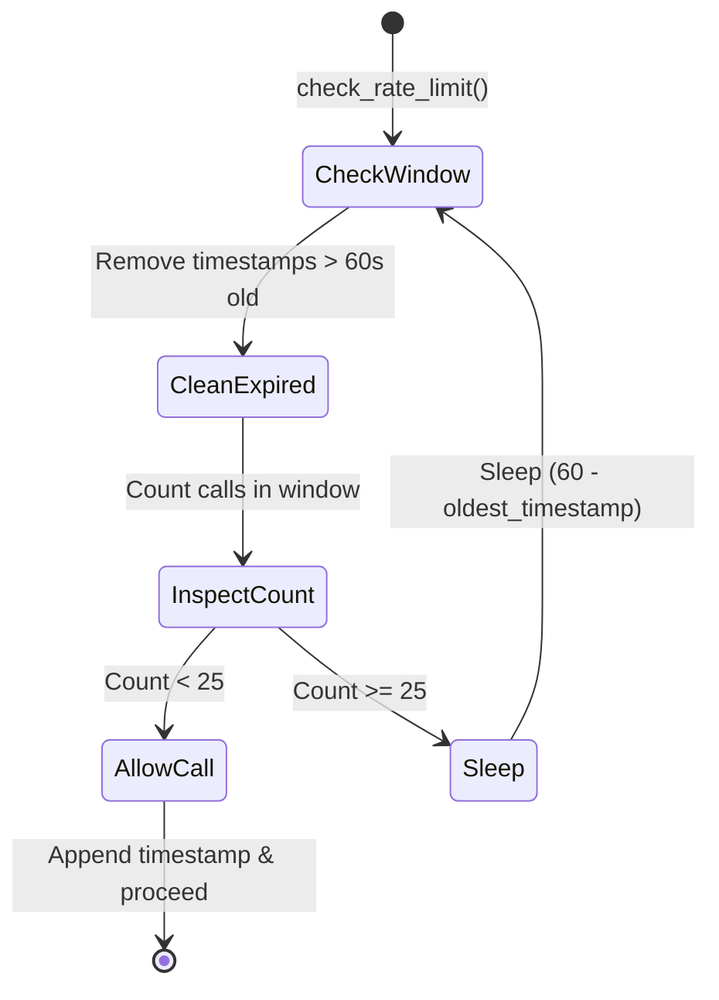

# Pipeline Execution Architecture

This document details the internal threading model, rate limiting, error handling mechanisms, and execution lifecycle of the pipeline orchestrator [`process.py`](../api/process.md).

---

## Execution Flowchart



---

## Concurrency & Thread Pool Architecture

The orchestrator utilizes Python's `concurrent.futures.ThreadPoolExecutor` to process multiple SKUs concurrently.

```python
with concurrent.futures.ThreadPoolExecutor(max_workers=thread_pool_size) as executor:
    futures = [
        executor.submit(
            process_single_product,
            idx, product, client, output_base,
            use_reference_images, force, use_image_description,
            use_reference_text, stop_event
        )
        for idx, product in enumerate(products, 1)
    ]
```

### Thread Safety & Interruption Handling
- **`stop_event` (threading.Event)**: If a `KeyboardInterrupt` (Ctrl+C) is caught, the orchestrator sets `stop_event`, cancels all pending tasks in the executor queue, and shuts down workers cleanly without leaving corrupted JSON files.
- **Deduplication & Resume Capability**: If `--force` is omitted and `output_dir / "index.html"` exists, the worker skips execution, enabling resumption after network disruptions.

---

## Rate Limiting Architecture

To prevent HTTP `429 Too Many Requests` when scaling concurrent workers, the pipeline enforces a global thread-safe sliding window rate limiter:



```python
rate_limit_lock = threading.Lock()
call_timestamps = []

def check_rate_limit():
    while True:
        with rate_limit_lock:
            now = time.time()
            global call_timestamps
            call_timestamps = [t for t in call_timestamps if now - t < 60]
            
            if len(call_timestamps) < 25:
                call_timestamps.append(now)
                return
                
            sleep_time = 60 - (now - call_timestamps[0])
            
        if sleep_time > 0:
            time.sleep(sleep_time)
```

---

## Error Handling & Resiliency Model

All API invocations route through [`call_gemini`](../api/utils.md), standardizing error capturing across the codebase:

```python
class LLMError(Exception):
    def __init__(self, original_error: Exception, metrics: StepMetrics):
        self.original_error = original_error
        self.metrics = metrics
        super().__init__(f"LLM call failed: {original_error}")
```

### Resiliency Ladder

1. **Exponential Backoff**: When an `APIError` is trapped, retry delays scale exponentially ($2^0, 2^1, 2^2\dots$) up to the configured retry count.
2. **Model Fallback**: If the primary model fails after maximum retries, the caller catches `LLMError` and redirects the prompt to the designated fallback model:
   - Primary: `ENRICH_MODEL_PRIMARY` (`gemini-3.1-pro-preview`)
   - Fallback: `ENRICH_MODEL_FALLBACK` (`gemini-3-flash-preview`)
3. **HTTP Error Telemetry**: Every error status code is tabulated in the product's [`StepMetrics.http_errors`](data-models.md#stepmetrics) dictionary for executive root-cause analysis.
