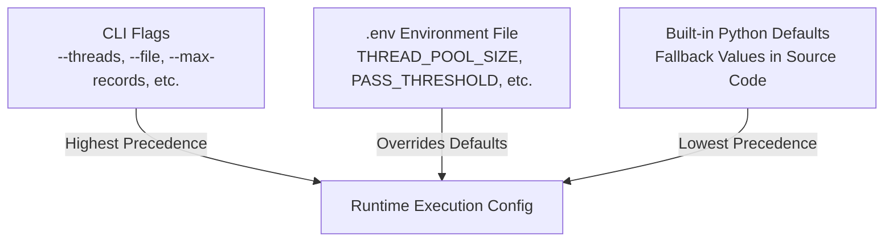

# Configuration Overview

The Walmart Product Generation Pipeline provides flexible configuration through **Environment Variables** (`.env`), **Command-Line Arguments** (CLI flags), and external markdown constraint definitions (`image_constraints.md`).

---

## Configuration Hierarchy & Precedence

When an option is specified at multiple levels:
1. **CLI Arguments** take the highest precedence.
2. **Environment Variables** set in `.env` override hardcoded defaults.
3. **Hardcoded Defaults** provide safe fallback operation if no configuration is provided.

---

## Configuration Topics

- [**Environment Variables Reference**](environment-variables.md): Full reference of all model IDs, temperature settings, prompts, instructions, timeouts, and thresholds.
- [**CLI Reference**](cli-reference.md): Detailed parameter documentation for `product-gen`, `product-gen-report`, `product-gen-gallery`, and `docs-*`.
- [**Image Constraints Specification**](image-constraints.md): Studio photography guidelines and technical image requirements.
