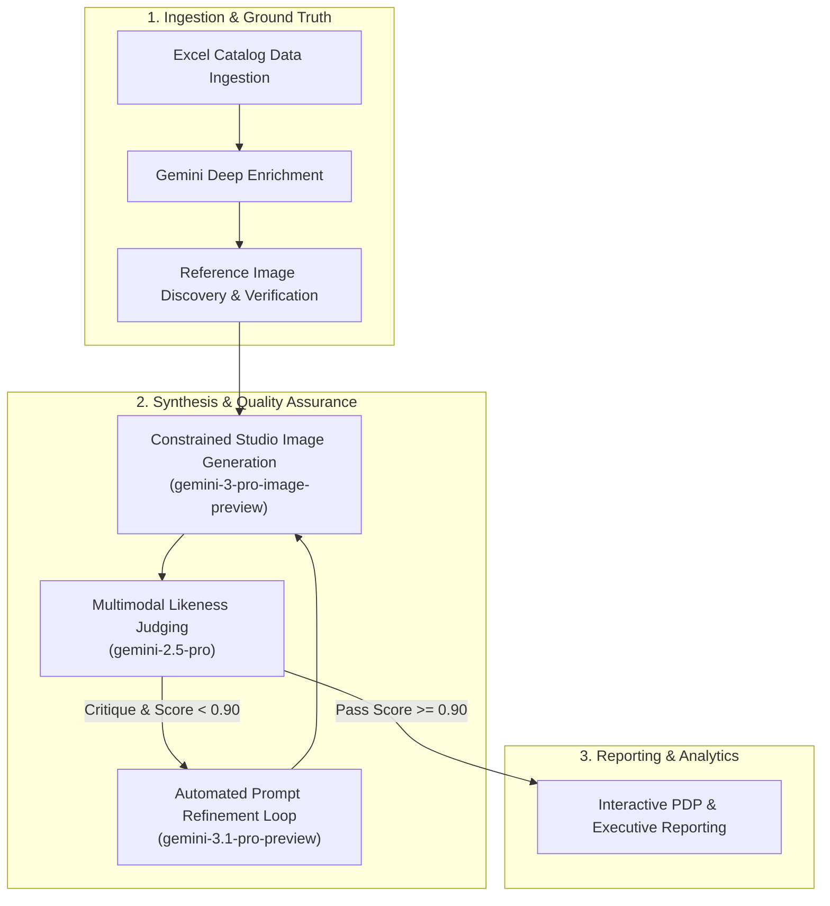

# Walmart Product Generation Pipeline

The **Walmart Product Generation Pipeline** is an enterprise-grade, multimodal AI processing engine engineered to automate the ingestion, enrichment, high-fidelity studio image synthesis, and automated quality auditing of catalog SKUs at scale.

Utilizing Google Cloud Vertex AI and Gemini generative models (`gemini-3.1-pro-preview`, `gemini-3-pro-image-preview`, `gemini-2.5-pro`, and `gemini-3.1-flash-lite`), the system transforms sparse, unstructured catalog entries into deeply categorized, Schema.org-compliant product records with photorealistic 2200x2200 studio assets and strict likeness validation.

---

## Key Capabilities



- **Structured Data Enrichment**: Extracts 4+ level category hierarchies, Schema.org attributes (brand, color, material, dimensions), key features, and dynamic photographic staging environments.
- **Automated Ground Truth Acquisition**: Multi-tiered reference discovery utilizing grounded Google Search and payload extraction, guarded by an automated multimodal catalog auditor.
- **Constrained Studio Generation**: High-resolution (2200x2200, 1:1 square, RGB 8-bit, 255/255/255 pure white seamless background) image rendering adhering to retail photography standards.
- **Multimodal Likeness Judge**: Objective visual evaluation comparing generated assets against original manufacturer references with structured scoring (`0.0` to `1.0`) and fine-grained critique.
- **Critique-Driven Self-Refinement**: Automated prompt rewriting loop that incorporates judge feedback to iteratively eliminate defects and reach pass thresholds.
- **Observability & Analytics Suite**: Per-SKU before/after comparative reports, Chart.js interactive execution dashboards, 11x17 landscape executive PDF reports, and responsive glassmorphic product galleries.

---

## Core System Architecture at a Glance

| Module | Core Responsibility | Primary Technology |
| :--- | :--- | :--- |
| [`product_reader.py`](architecture/data-models.md) | Excel parsing, column normalization, and WPID deduplication | `pandas`, `openpyxl`, `Pydantic v2` |
| [`process.py`](workflow/index.md) | Thread-pool orchestration, pipeline execution, rate limiting | `google-genai`, `ThreadPoolExecutor` |
| [`image_finder.py`](workflow/reference-acquisition.md) | Grounded web search, payload extraction, image verification | Gemini Flash + Google Search tool, `urllib` |
| [`model.py`](architecture/data-models.md) | Strongly-typed domain models, telemetry structures | `Pydantic v2`, Schema.org alignment |
| [`pdp.py`](reporting/pdp-reports.md) | Comparative Before/After PDP HTML report with modal inspection | HTML5, CSS Variables, Vanilla JS |
| [`generate_report.py`](reporting/dashboard.md) | Metric aggregation, Chart.js dashboard generation | `Chart.js`, `Python` |
| [`report.py`](reporting/pdf-reports.md) | Executive print-ready PDF reporting | `ReportLab Platypus`, 11x17 Landscape |
| [`build_gallery.py`](reporting/gallery.md) | Enterprise glassmorphic product showcase | HTML5, Responsive Grid |

---

## Quick Navigation

<div class="grid cards" markdown>

-   :material-sitemap: __Architecture__

    ---

    Explore system architecture, block diagrams, concurrency controls, and Pydantic data models.

    [:octicons-arrow-right-24: System Architecture](architecture/index.md)

-   :material-sync: __End-to-End Workflow__

    ---

    Deep dive into the 7-step execution lifecycle, from data ingestion to likeness evaluation and prompt refinement.

    [:octicons-arrow-right-24: Pipeline Workflow](workflow/index.md)

-   :material-chart-box: __Reporting & Dashboards__

    ---

    Inspect interactive Before & After PDP reports, KPI execution dashboards, and executive PDF generators.

    [:octicons-arrow-right-24: Reporting Suite](reporting/index.md)

-   :material-cog: __Configuration__

    ---

    Review environment variables, model parameters, CLI options, and retail photography constraints.

    [:octicons-arrow-right-24: Configuration Reference](configuration/index.md)

</div>

---

## Quickstart

### 1. Synchronization

Synchronize the project dependencies using `uv`:

```bash
uv sync
```

### 2. Configure Environment

Create a `.env` file from the provided example template:

```bash
cp dot_env_example.txt .env
```

Ensure your `GEMINI_API_KEY` or Google Cloud Project credentials are configured in `.env`.

### 3. Execute Pipeline

Run the end-to-end pipeline across sample catalog records:

```bash
uv run product-gen --file data/Google_50_skus_image_generation.xlsx --max-records 5
```

### 4. Serve Documentation Site

Launch the local documentation server with live reloading:

```bash
uv run docs-serve
```
