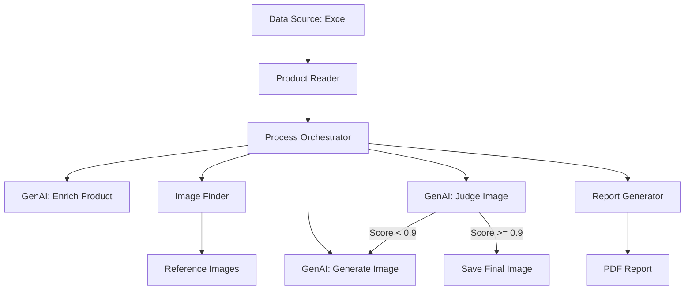
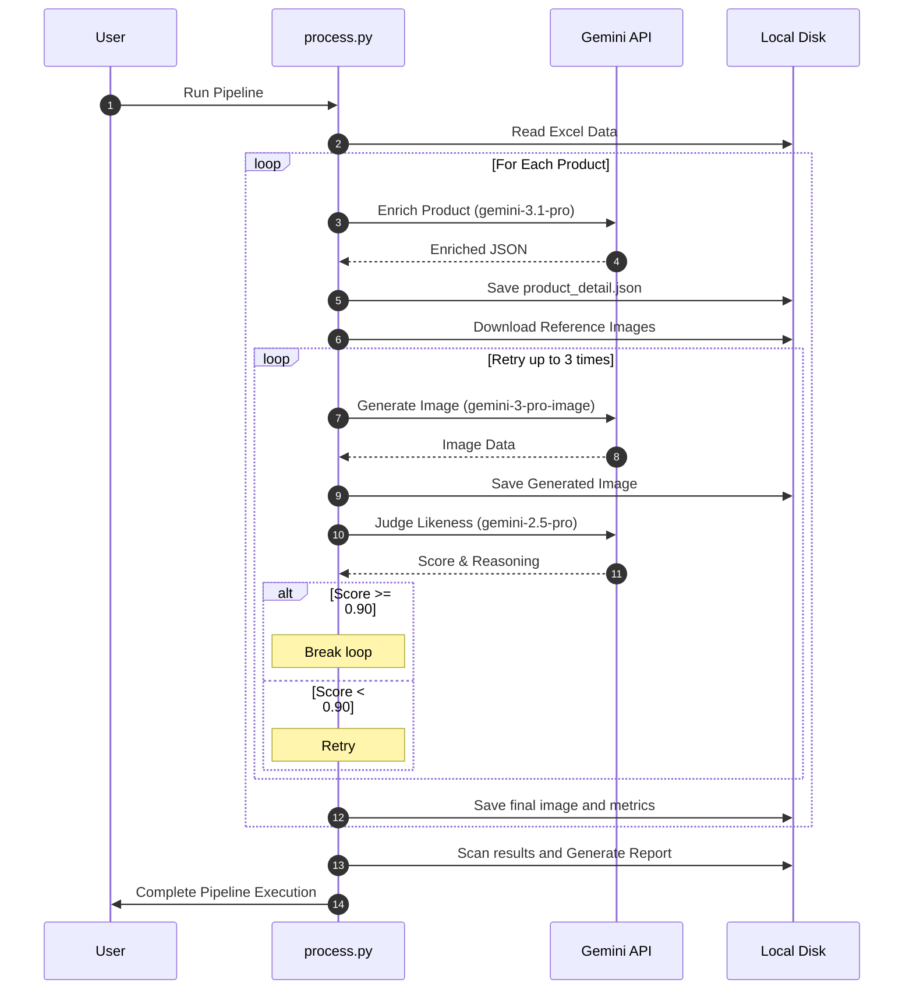

# Product Generation Pipeline Architecture

This document describes the architecture and execution flow of the Walmart Product Generation Pipeline.

## Architecture Overview

The pipeline is designed to enrich product data, generate high-fidelity product imagery, and evaluate the generated images against reference assets to ensure quality and consistency.

### Block Diagram

## Detailed Process Steps

### 1. Data Loading
The process begins by reading product data from an Excel file (`data/Google_50_skus_image_generation.xlsx`). The `product_reader.py` module parses the file into structured Pydantic models (`ProductImageGenerationData`).

### 2. Product Enrichment
For each product, the pipeline calls the Gemini API (primary: `gemini-3.1-pro-preview`, fallback: `gemini-3-flash-preview`) to enrich the basic product data.
- **Input**: Original product JSON.
- **Output**: `ProductEnrichment` object containing formal name, category hierarchy, attributes, suggested environments, and a detailed description.
- **Prompt Grounding**: The prompt uses a JSON schema derived from Pydantic models to ensure structured output.

### 3. Reference Image Acquisition
The `ImageFinder` component extracts image URLs from the product data and downloads the physical images to the output directory. These serve as the ground truth for likeness evaluation.

### 4. Image Generation
The pipeline generates a main product image on a seamless white background.
- **Model**: `gemini-3-pro-image-preview` (via `generate_content`).
- **Prompt**: Combines image constraints (resolution, color space, background) with the enriched product description.
- **Parameters**: 2K resolution is requested via the prompt (as the model doesn't support it as a direct parameter).

### 5. The Judge (Likeness Evaluation)
This is a critical step where generated images are evaluated against original reference images to ensure visual consistency.

#### How it Works
The `judge_product_likeness` function calls `gemini-2.5-pro` with:
1.  **Original Reference Images**: Passed as image parts.
2.  **Generated Image**: Passed as an image part.
3.  **Product Description**: Text description to ground the evaluation.

#### The Evaluation Criteria
The model acts as a strict quality control judge, evaluating:
- **Visual Match**: Does the generated product look like the original?
- **Color Consistency**: Are colors accurate?
- **Details**: Are key features preserved?

#### Structured Output
The Judge returns a JSON object matching the `ProductLikenessReview` schema:
- **Score**: A float between `0.0` and `1.0`.
- **Reasoning**: A detailed explanation of why the score was given, comparing specific features.

#### Retry Loop
If the score is less than `0.9`, the pipeline retries image generation (up to 3 times). If it fails all retries, it records the failure but saves the best attempt.

### 6. Reporting
After processing, `generate_report.py` scans the output directories, aggregates metrics (time, tokens, cost), and calls `report.py` to generate a premium PDF report (`pipeline_report.pdf`) in 11x17 landscape format.

## Sequence Diagram

