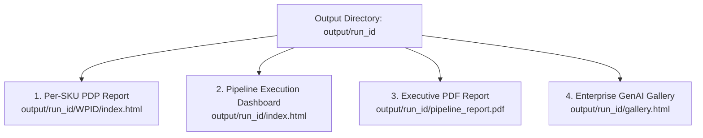

# Reporting & Visualizations

The Walmart Product Generation Pipeline provides an integrated analytics and visualization suite spanning interactive per-SKU Before & After audit pages, executive execution dashboards, print-ready PDF reports, and responsive catalog galleries.

---

## Reporting Portfolio Overview

---

## Feature Matrix

| Report Type | Generated By | Primary Audience | Key Features |
| :--- | :--- | :--- | :--- |
| [**Interactive PDP Report**](pdp-reports.md) | `pdp.py` | Catalog QA & Merchandisers | Side-by-side Before/After diff, modal inspection, step-by-step latency & token flow timeline. |
| [**Execution Dashboard**](dashboard.md) | `generate_report.py` | Engineers & Operations | Interactive Chart.js score distributions, category-level pass/review stacks, instant score range filtering. |
| [**Executive PDF Report**](pdf-reports.md) | `report.py` | Leadership & Finance | 11x17 landscape ReportLab document, token accounting, tiered cost projections, SKU-level table. |
| [**Enterprise Gallery**](gallery.md) | `build_gallery.py` | Marketing & Merchandising | Modern glassmorphic responsive product grid with lazy loading and deep-links to audit reports. |

---

## Accessing Reports

- **Individual Product Report**: Open `output/<run_name>/<wpid>/index.html` in any web browser.
- **Aggregated Execution Dashboard**: Open `output/<run_name>/index.html`.
- **Regenerate Executive Reports**: Run `uv run product-gen-report --dir output/<run_name>`.
- **Regenerate Gallery Showcase**: Run `uv run product-gen-gallery --dir output/<run_name>`.
