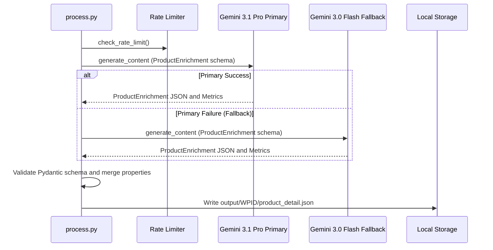

# Step 2: GenAI Product Enrichment

The enrichment stage transforms sparse catalog metadata into comprehensive, Schema.org-aligned product descriptions and 4+ level retail taxonomy classifications using Gemini generative models.

---

## Process Overview



---

## Prompt Engineering & Schema Enforcement

Enrichment enforces strict JSON output utilizing Gemini's structured output capability (`response_schema=ProductEnrichment`):

```python
prompt_template = os.environ.get(
    "ENRICH_PROMPT",
    "Provide the output strictly conforming to the following JSON schema:\n{schema}\n\nProduct Info:\n{product_json}"
)
```

### System Instruction
```text
You are an Expert Merchandiser for Walmart. Your goal is to produce deep, enriched product detail profiles that conform to the requested schema.
```

### Generated Schema Components

1. **Formal Product Name (`product_name`)**: A descriptive title incorporating brand, model, and key specifications.
2. **Category Hierarchy (`category`)**: A standardized 4+ level classification (`level_1` through `level_5`).
3. **Structured Attributes (`attributes`)**: Physical dimensions, color, material, brand, target audience, and key feature bullets.
4. **Suggested Natural Environments (`suggested_natural_environments`)**: 2 to 3 visual descriptions of real-world lifestyle photography environments.
5. **Detailed Narrative Description (`detailed_description`)**: A rich, cohesive description synthesizing all known physical characteristics.

---

## Fallback & Execution Logic

```python
@retry_with_backoff(max_retries=3)
def enrich_product(client: genai.Client, product_json: str) -> tuple[DetailedProduct, StepMetrics]:
    primary_model = os.environ.get("ENRICH_MODEL_PRIMARY", "gemini-3.1-pro-preview")
    fallback_model = os.environ.get("ENRICH_MODEL_FALLBACK", "gemini-3-flash-preview")
    
    # Execution using unified wrapper with metrics collection
    ...
```

If the product already has higher-confidence category levels in `product_long_description.category_level1`, the orchestrator preserves the supplier's explicit classification hierarchy.
