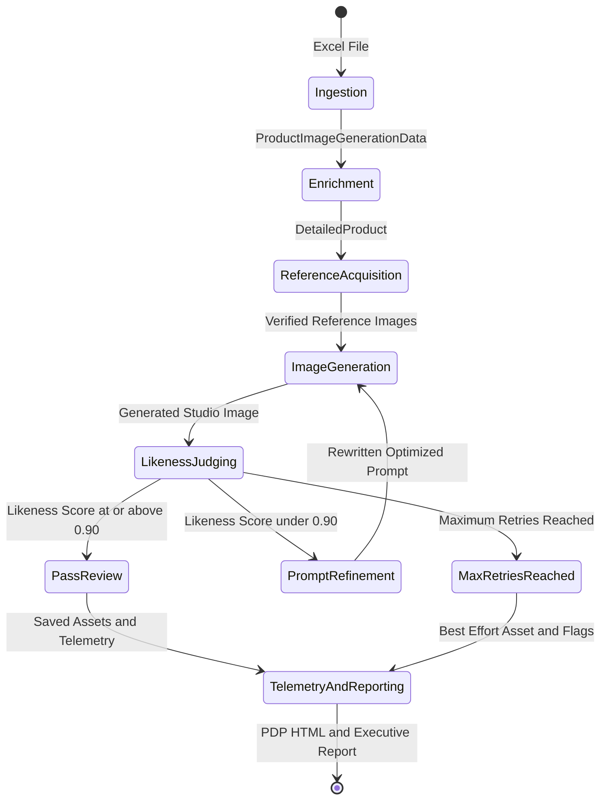

# End-to-End Workflow

The Walmart Product Generation Pipeline processes each catalog record through seven distinct, sequential execution stages.

---

## High-Level Lifecycle

---

## Summary of Stages

| Step | Stage Name | Module / Entrypoint | Output Artifacts | Primary Models |
| :--- | :--- | :--- | :--- | :--- |
| **1** | [**Ingestion & Normalization**](ingestion.md) | `product_reader.py` | `List[ProductImageGenerationData]` | N/A (Pandas / Openpyxl) |
| **2** | [**GenAI Enrichment**](enrichment.md) | `process.py:enrich_product` | `product_detail.json` | `gemini-3.1-pro-preview` |
| **3** | [**Reference Acquisition & Verification**](reference-acquisition.md) | `image_finder.py:download_reference_images` | `reference_images/ref_*.jpg` | `gemini-3.1-flash-lite` |
| **4** | [**Studio Image Generation**](image-generation.md) | `process.py:generate_and_judge_images` | `generated/image_1_attempt_*.jpeg` | `gemini-3-pro-image-preview` |
| **5** | [**Likeness Quality Judging**](likeness-judging.md) | `process.py:judge_product_likeness` | `ProductLikenessReview` (score, text) | `gemini-2.5-pro` |
| **6** | [**Prompt Self-Refinement**](self-refinement.md) | `process.py:rewrite_prompt_with_feedback` | Optimized Prompt Text | `gemini-3.1-pro-preview` |
| **7** | [**Observability & Telemetry**](metrics-and-telemetry.md) | `pdp.py`, `generate_report.py`, `report.py` | `index.html`, `pipeline_report.pdf` | Telemetry Engine |

---

## Detailed Stage Documentation

Select a stage to explore implementation details, prompt engineering strategies, and schema definitions:

- [**Step 1: Ingestion & Normalization**](ingestion.md)
- [**Step 2: GenAI Enrichment**](enrichment.md)
- [**Step 3: Reference Acquisition & Verification**](reference-acquisition.md)
- [**Step 4: Studio Image Generation**](image-generation.md)
- [**Step 5: Likeness Quality Judging**](likeness-judging.md)
- [**Step 6: Prompt Self-Refinement**](self-refinement.md)
- [**Step 7: Observability & Telemetry**](metrics-and-telemetry.md)
