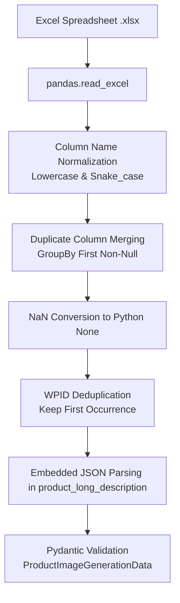

# Step 1: Ingestion & Normalization

The ingestion layer implemented in [`product_reader.py`](../api/product_reader.md) is responsible for loading arbitrary retailer Excel files, reconciling disparate column formats, deduplicating SKU keys, and parsing embedded JSON payloads into structured [`ProductImageGenerationData`](../architecture/data-models.md#productimagegenerationdata) objects.

---

## Process Overview



---

## Key Data Transformation Rules

### 1. Column Normalization & Merging
Different spreadsheet formats frequently introduce whitespace variations or case differences (e.g., `Product Name`, `product_name`, `PRODUCT NAME`). Column headers are lowercased and spaces replaced with underscores:

```python
df.columns = [str(c).lower().replace(' ', '_') for c in df.columns]
if df.columns.duplicated().any():
    df = df.T.groupby(level=0).first().T
```

### 2. WPID Deduplication
To avoid redundant LLM invocations and race conditions on storage directories, records are deduplicated on the Walmart Product ID (`wpid`):

```python
if "wpid" in df.columns:
    df.drop_duplicates(subset=["wpid"], keep="first", inplace=True)
```

### 3. Embedded JSON Extraction
Catalog export feeds often store nested supplier details inside `product_long_description` as a serialized JSON string. The reader inspects string values starting with `{` and unpacks them into [`ProductLongDescriptionDetail`](../architecture/data-models.md):

```python
pld = record.get("product_long_description")
if isinstance(pld, str) and pld.strip().startswith("{"):
    try:
        record["product_long_description"] = json.loads(pld)
    except json.JSONDecodeError:
        pass
```

### 4. Category Fallback Mapping
If `product_category` is present while `product_type` is absent, the field is automatically re-mapped:

```python
if "product_category" in record and not record.get("product_type"):
    record["product_type"] = record["product_category"]
```

---

## Code Example

```python
from pathlib import Path
from product_gen.product_reader import read_product_data

# Read and validate all SKUs
products = read_product_data("data/Google_50_skus_image_generation.xlsx")

print(f"Loaded {len(products)} validated product models.")
for p in products[:3]:
    print(f"- WPID: {p.wpid} | Name: {p.product_name}")
```
