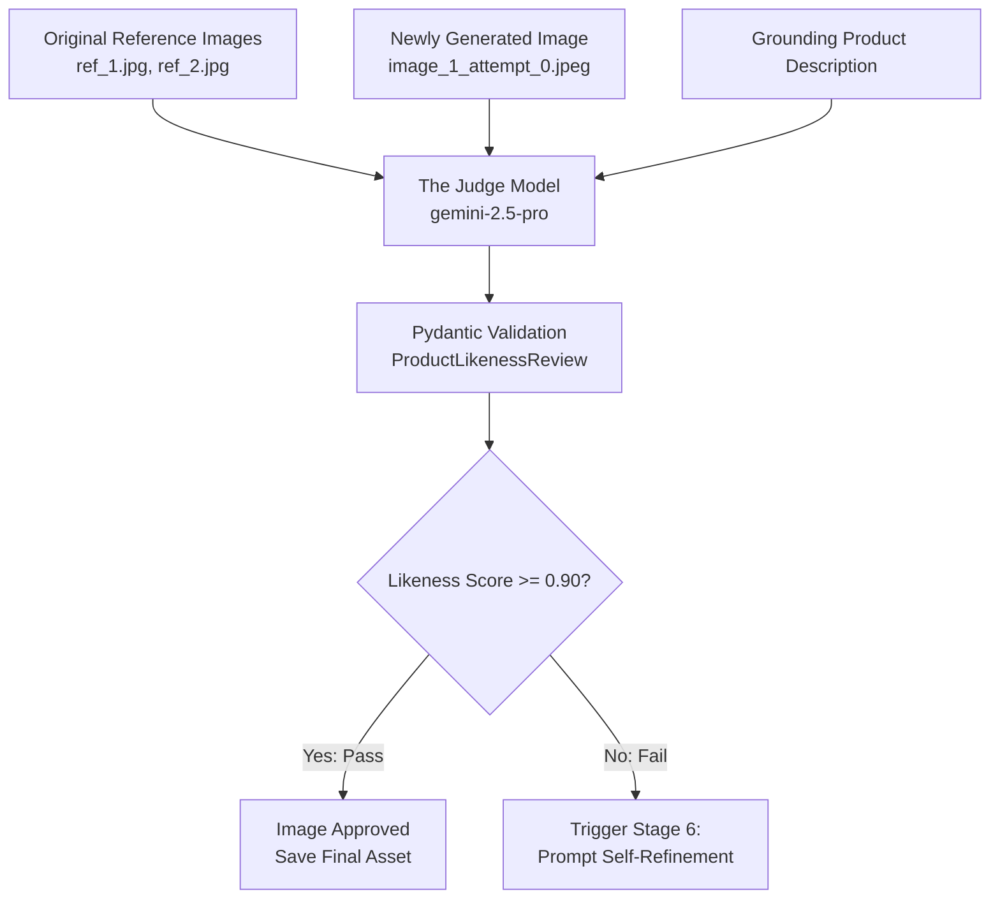

# Step 5: Likeness Quality Judging

The **Judge** multimodal quality assurance mechanism evaluates generated images against verified reference images to prevent hallucinated visual artifacts, inaccurate geometries, or incorrect branding.

---

## Evaluation Architecture



---

## Multimodal Evaluation Schema

The judge receives both visual and textual inputs and outputs a strictly structured JSON payload matching [`ProductLikenessReview`](../architecture/data-models.md#productlikenessreview):

```python
class ProductLikenessReview(BaseModel):
    score: float = Field(description="Likeness score between 0.0 and 1.0")
    reasoning: str = Field(description="Detailed reasoning for the score")
```

### System Instruction
```text
You are an expert product catalog auditor for Walmart. Compare the generated image against the original reference image(s) and description. Score likeness from 0.0 to 1.0. When evaluating likeness, prioritize the physical product and its packaging. Do not be overly critical of the surrounding content or environment. For products with screens, the specific background image does not need to be an exact match, but UI elements must be accurate. Ensure the image meets retail productization standards.
```

---

## Likeness Audit Criteria

The judge evaluates candidate images against four key dimensions:

1. **Structural & Geometric Fidelity**: Accurate aspect ratios, silhouette curvature, port placements, button counts, and seams.
2. **Color & Material Accuracy**: Faithful representation of finishes (glossy vs. matte, metallic sheen, leather grain, fabric weave) and color tones.
3. **Branding & Typographic Integrity**: Verification that labels, logos, and printed claims match the authentic product without hallucinated text.
4. **Studio Compliance**: Strict adherence to a seamless pure white (255, 255, 255) background with zero extraneous props or shadow artifacts.

---

## Edge Case: Missing Reference Images

When reference images are unavailable, the judge cannot perform ground-truth visual comparison. In this scenario:
- The image review is marked with `score = 0.0`.
- The reasoning explicitly records: `"No reference images provided for likeness evaluation. Automatically flagged for manual review."`
- The pipeline proceeds to generate report artifacts while categorizing the SKU in the **Need Review** status bucket.
