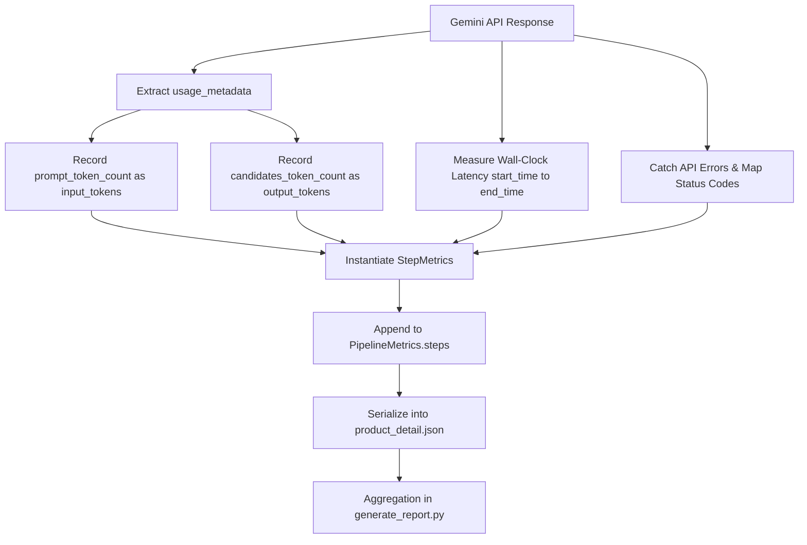

# Step 7: Metrics, Telemetry & Cost Modeling

The pipeline captures complete operational telemetry across all model calls, token usage, latency profiles, and retry attempts, computing accurate cost projections for enterprise cost management.

---

## Telemetry Flow & Collection

---

## Cost Modeling & Pricing Algorithms

[`generate_report.py`](../api/generate_report.md) calculates costs per step and SKU using tiered pricing models based on standard Vertex AI rates:

### Token Pricing Tiers (Per Million Tokens)

| Model Tier | Input Rate ($\le$ 200k tokens) | Input Rate (> 200k tokens) | Output Rate ($\le$ 200k tokens) | Output Rate (> 200k tokens) |
| :--- | :--- | :--- | :--- | :--- |
| **Gemini 2.5 Pro** | `$1.25 / M` | `$2.50 / M` | `$10.00 / M` | `$15.00 / M` |
| **Enterprise Discount** | `10% Discount Applied` | `10% Discount Applied` | `10% Discount Applied` | `10% Discount Applied` |

### Mathematical Formula

$$\text{Base Cost} = (\text{Input Tokens} \times \text{Rate}_{\text{input}}) + (\text{Output Tokens} \times \text{Rate}_{\text{output}})$$

$$\text{Net Cost} = \text{Base Cost} \times 0.90$$

---

## Aggregated KPI Metrics

The pipeline dashboard computes key production metrics:

- **Success vs. Failure Counts**: Distribution of SKUs that passed the likeness quality gate vs. those flagged for manual review.
- **Success by Attempt Buckets**:
  - `Try 1`: Passed on initial attempt (0 retries).
  - `Try 2`: Passed on 1st prompt refinement attempt.
  - `Try 3`: Passed on 2nd prompt refinement attempt.
  - `Try 4+`: Passed on subsequent attempts.
  - `Failed`: Exceeded maximum retries without reaching `PASS_THRESHOLD`.
- **Latency Distribution**: Minimum, maximum, and mean processing time per product.
- **Median Retries to Pass**: Median retry count among passing products.
- **HTTP Error Distribution**: Breakdown of status codes (e.g., `429`, `500`, `503`).
