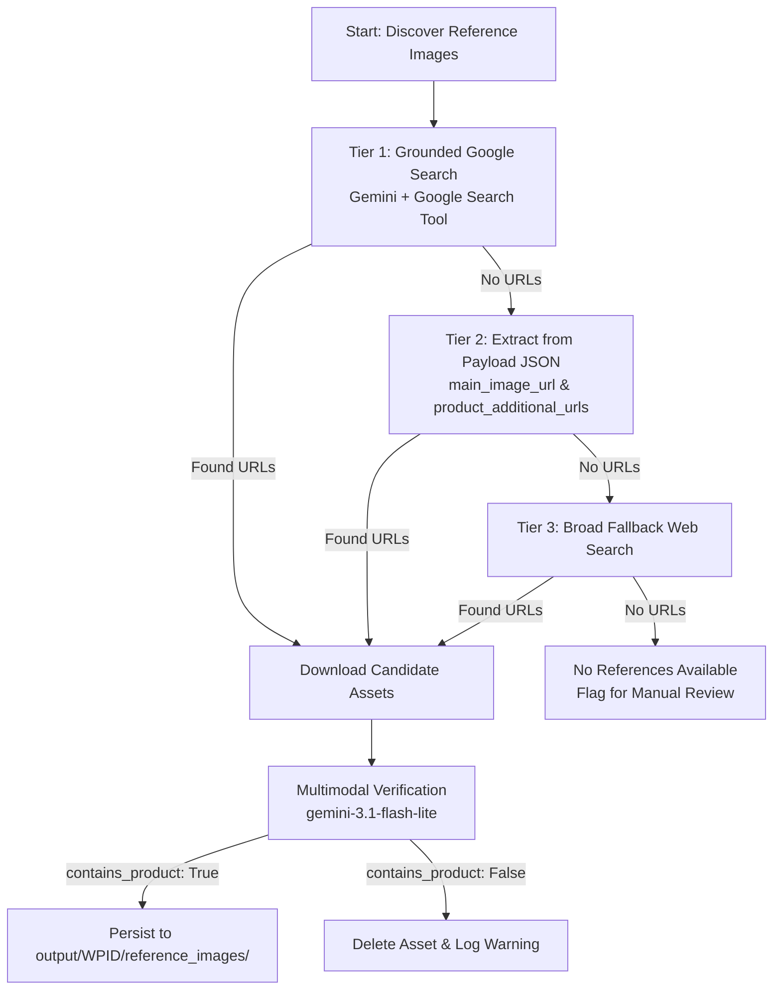

# Step 3: Reference Acquisition & Verification

To establish an uncompromised ground truth for downstream quality evaluation, [`ImageFinder`](../api/image_finder.md) searches, extracts, downloads, and visually audits authentic manufacturer imagery.

---

## Multi-Tier Discovery Ladder



---

## 1. Grounded Search Execution

`ImageFinder.search_image_urls` prompts Gemini with tool-grounded Google Search enabled to locate official manufacturer assets while explicitly rejecting competitor e-commerce domains:

```python
response, metrics = call_gemini(
    client=self.client,
    model=search_model, # gemini-3.1-flash-lite
    contents=prompt,
    config=types.GenerateContentConfig(
        tools=[{"google_search": {}}],
        temperature=0.2,
        response_mime_type="application/json",
        system_instruction=os.environ.get("SEARCH_INSTRUCTIONS", "")
    ),
    step_name="Search Image URLs"
)
```

### Search Filtering Constraints
- Prioritizes official brand domains and manufacturer media kits.
- Explicitly rejects secondary marketplaces: Amazon, eBay, Target, Shopify.
- Permits `walmart.com` CDN URLs if primary manufacturer assets are unreachable.

---

## 2. Scraping & Download Layer

Images are retrieved using a spoofed browser User-Agent header to avoid HTTP `403 Forbidden` responses from media hosting CDNs:

```python
req = urllib.request.Request(
    url,
    headers={
        'User-Agent': 'Mozilla/5.0 (Windows NT 10.0; Win64; x64) AppleWebKit/537.36...',
        'Accept': 'text/html,application/xhtml+xml,application/xml;q=0.9,image/avif,image/webp,image/apng,*/*;q=0.8',
        'Referer': 'https://www.google.com/'
    }
)
```

---

## 3. Multimodal Catalog Auditor Verification

Downloaded files frequently turn out to be logos, nutrition labels, shipping cartons, or placeholder badges. `ImageFinder.verify_reference_image` performs a zero-shot multimodal classification on every downloaded file before accepting it into the ground-truth set:

```python
contents = [
    types.Part.from_bytes(data=img_bytes, mime_type=mime),
    f"Analyze this image. Does it contain the actual physical product described as '{product_name}'? Or is it just a logo, text label, or unrelated content? Return JSON with 'contains_product' (boolean) and 'reasoning' (string)."
]
```

If `contains_product` returns `False`, the corrupted or non-product asset is deleted from the filesystem immediately (`dest_path.unlink(missing_ok=True)`).

---

## 4. Optional: Image-Based Physical Describing

When `--use-image-description` is specified, the pipeline executes `describe_product_from_images` (`gemini-3.1-pro-preview`):
- Isolates construction materials, exact sRGB color hex codes (`#FF5733`), cut/stitching patterns, and visible typography.
- Stores the physical description in `DetailedProduct.image_based_description` to condition downstream image generation prompts.
