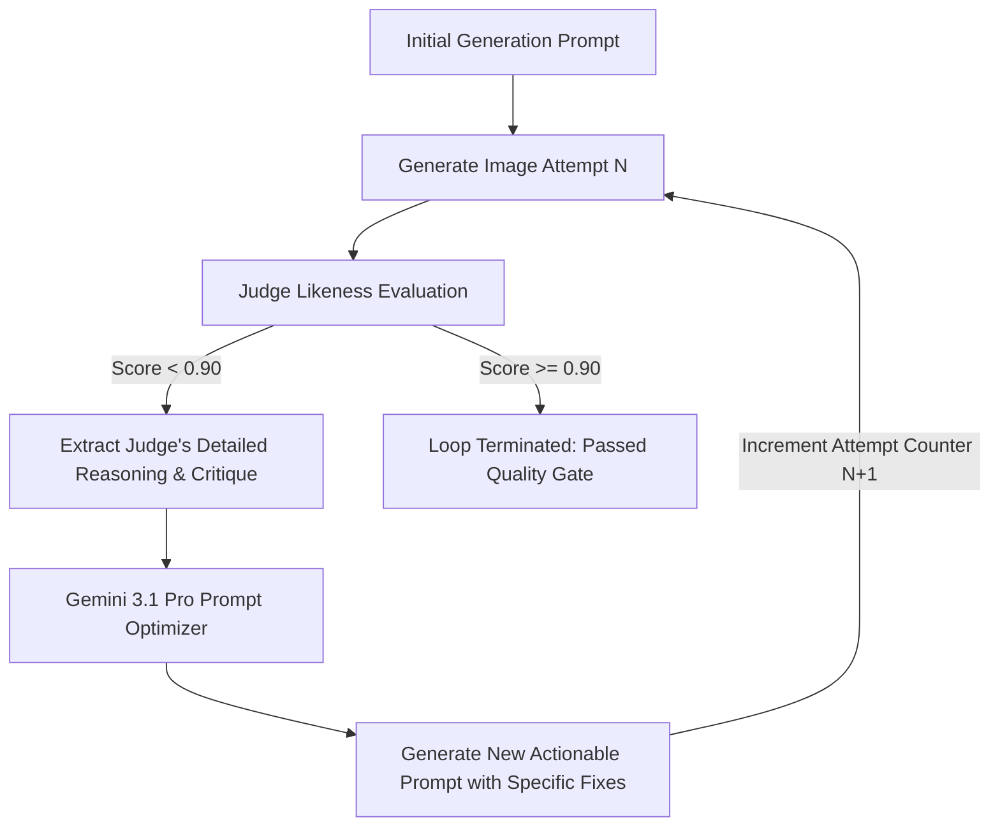

# Step 6: Prompt Self-Refinement

When a generated image fails likeness verification (score < `PASS_THRESHOLD`), the pipeline engages an automated **Critique-Driven Prompt Refinement Loop** powered by `gemini-3.1-pro-preview`.

---

## Feedback & Optimization Loop



---

## Implementation Details

The refinement function [`rewrite_prompt_with_feedback`](../api/process.md) constructs a prompt engineering optimization task:

```python
def rewrite_prompt_with_feedback(
    client: genai.Client,
    original_prompt: str,
    reasoning: str,
    retry: int
) -> tuple[str, StepMetrics]:
    prompt_template = os.environ.get(
        "REWRITE_PROMPT",
        "You are an expert prompt engineer for text-to-image models. Your task is to improve an image generation prompt based on feedback from a quality judge.\n\nOriginal Prompt:\n{original_prompt}\n\nJudge's Feedback/Reasoning for Failure:\n{reasoning}\n\nGenerate a new, optimized prompt that incorporates the feedback to fix the issues. Make the instructions specific, actionable, and clear for the image generator. Output ONLY the new prompt text, nothing else."
    )
    prompt = prompt_template.format(original_prompt=original_prompt, reasoning=reasoning)
    
    # Executes with gemini-3.1-pro-preview at temperature 0.5
    ...
```

---

## Iterative Convergence Example

### Attempt 0
- **Original Prompt**: `"Studio photo of black wireless gaming mouse on white background."`
- **Judge Review**: `Score: 0.72` — *"The generated mouse is completely matte black, but the authentic reference has RGB LED lighting strips along the thumb groove and a textured honeycomb grip on the sides."*

### Attempt 1 (Rewritten by Refinement Engine)
- **Rewritten Prompt**: `"Studio photo of black wireless gaming mouse on seamless 255/255/255 white background. Emphasize side panels featuring an intricate hexagonal honeycomb texture. Include a subtle, illuminated RGB LED accent strip running continuously along the thumb groove contour."`
- **Judge Review**: `Score: 0.94` — *"Hexagonal honeycomb side grip and RGB lighting match reference ground truth accurately. Background is pure white."*
- **Outcome**: Quality gate passed. Image marked as approved.
